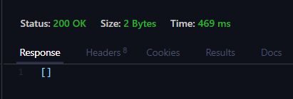
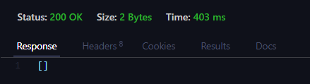
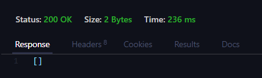
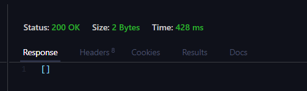

# Proyecto de Fabricadora de Ropa que a la ves es tienda

Este proyecto de API, diseñado para la gestión de una Fabricadora y vendedora de ropa, se erige como una herramienta fundamental en el entorno de produccion y administrativo de este tipo de establecimientos. Al permitir una gestión más eficiente y precisa, ofrece numerosos beneficios tanto para el personal de la fabricadora como para los compradores.

La gestión de los procesos se ve beneficiada con la capacidad de almacenar y acceder a información detallada sobre cada proceso realizado, lo que facilita el seguimiento de de cada proceso a lo largo del tiempo. Esta capacidad es esencial para la empresa, ya que les permite tomar decisiones acciones sobre cada proceso.

## Características 📝

- Registro de  los usuarios.
- Autenticación con usuario y contraseña con JWT.
- Generación de Refresh Token.
- CRUD completo para cada entidad.
- Vista de las consultas requeridas.

## 1. Endpoints 📝:

1. Listar los proveedores que sean persona natural.

URL

http://localhost:5258/api/Proveedor/Consulta1B

resultado

2. Listar las prendas de una orden de producción cuyo estado sea en producción. El usuario debe ingresar el número de orden de producción.

URL
http://localhost:5258/api/Orden/Consulta2B/{numero}

Resultado

3. Listar las prendas agrupadas por el tipo de protección.

URL
http://localhost:5258/api/Prenda/Consulta3B

Resultado

7. Listar las ventas realizadas por un empleado especifico. El usuario debe ingresar el Id del empleado y mostrar la siguiente información.

1. Id Empleado
2. Nombre del empleado
3. Fecturas : Nro Factura, fecha y total de la factura.

URL
http://localhost:5258/api/venta/Consulta7B/{id}

Resultado 

## Desarrollo ⌨️
Este proyecto utiliza varias tecnologías y patrones, incluidos:

Patrón Repository y Unit of Work para la gestión de datos.

AutoMapper para el mapeo entre entidades y DTOs.
